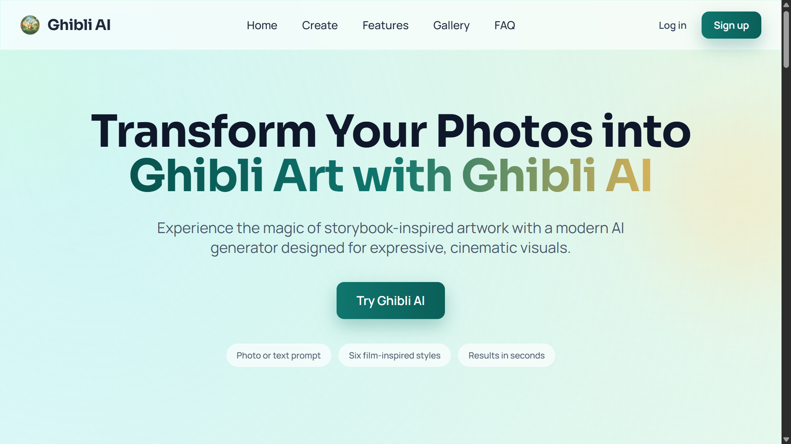
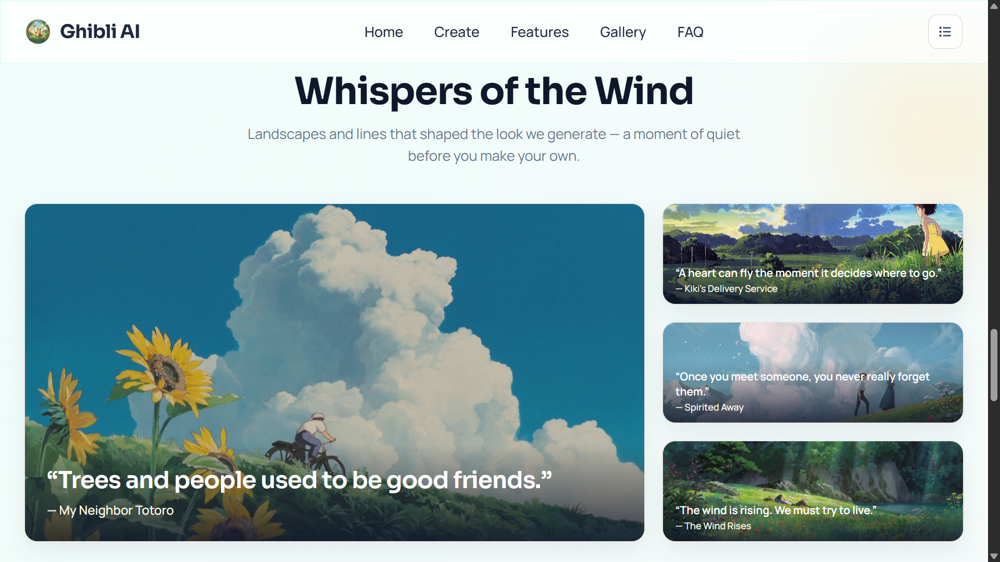
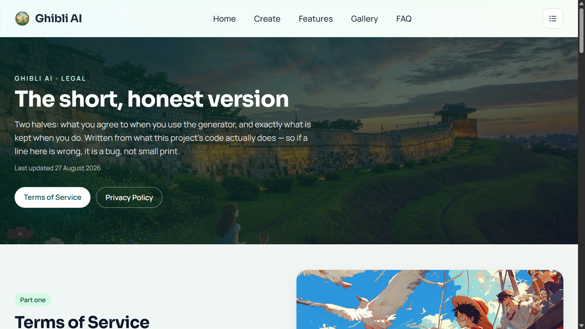
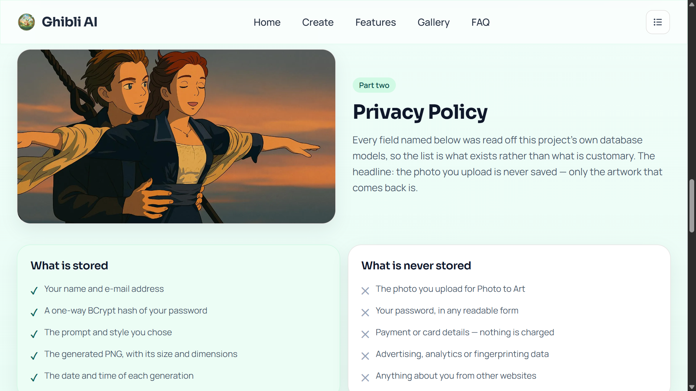
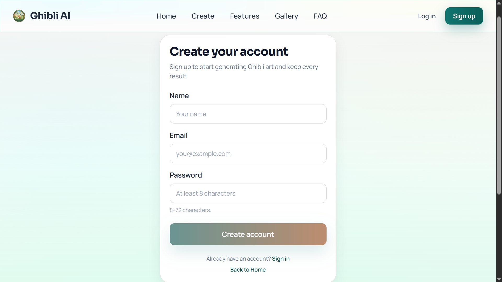
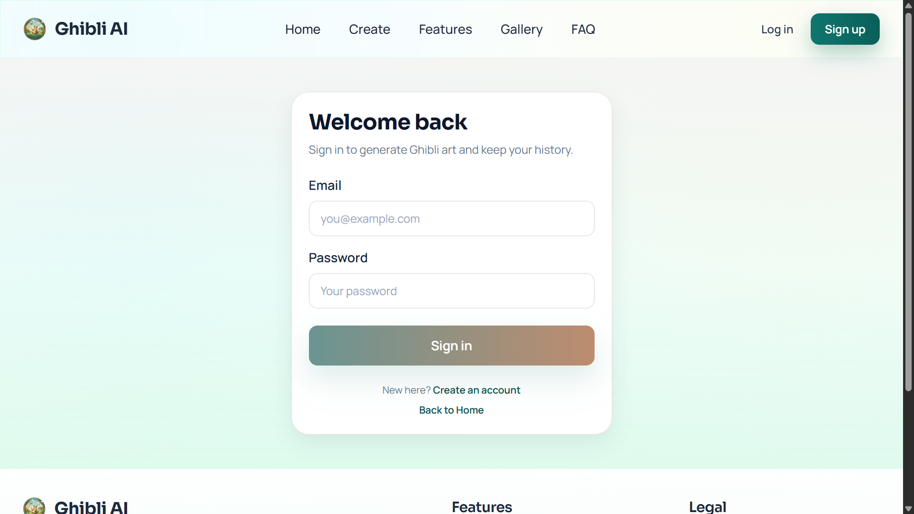

# Ghibli AI — the interface

The React front end of **Ghibli AI**: upload a photo or type a sentence, pick one of six
film-named styles, and get a Ghibli-looking PNG back. It also keeps every image you make, keeps
you signed in across a refresh, and tells you *which* of seven upstream failures just happened
instead of printing one flat sentence for all of them.

This file is about the interface — the routes, the pages, the interactions, and the handful of
features that only become visible when something goes wrong. The data model, the request flow and
the API contract live in [the backend README](../ghbliapi/README.md).

| | |
| --- | --- |
| **Stack** | React 19 · react-router-dom 7 · Vite 5 · Tailwind CSS 3 |
| **HTTP** | `fetch` only — no axios, no data-fetching library |
| **State** | React state plus three plain modules: `authStorage`, `generationDraftStore`, `generationEvents` |
| **Tests** | vitest + jsdom + Testing Library — `npm test` |
| **Deploy** | Vercel, SPA rewrite in [`vercel.json`](vercel.json) |

## Contents

1. [The two applications](#the-two-applications)
2. [Routes](#routes)
3. [The pages](#the-pages)
4. [Features that are not visible until they matter](#features-that-are-not-visible-until-they-matter)
5. [Design system](#design-system)
6. [Tech stack](#tech-stack)
7. [Setup](#setup)
8. [Tests and build](#tests-and-build)
9. [Deployment](#deployment)
10. [Screenshots](#screenshots)
11. [Project layout](#project-layout)
12. [License](#license)

## The two applications

| Folder | What it is |
| --- | --- |
| `ghbli-art-generator` | This app. React + Vite, deployed to Vercel. |
| `ghbliapi` | Spring Boot + MongoDB + Stability AI, deployed to Render. [Its README](../ghbliapi/README.md) covers the models, the request flow and the error contract. |

Nothing is shared between them at build time. The only contract is HTTP: multipart or JSON in,
`image/png` or `application/problem+json` out.

## Routes

Every route is declared in [`src/App.jsx`](src/App.jsx). Two things are worth reading off the
table rather than the file: five paths render **one** `HomePage` and differ only in which section
they scroll to, and `*` is a real 404 rather than a silent fallback to the landing page.

| Path | Renders | Notes |
| --- | --- | --- |
| `/` `/home` `/features` `/gallery` `/faq` | `HomePage` | One page, five entry points. Each path scrolls to its own section with its own offset (`/home` 96px, `/features` 16px, `/gallery` 16px, `/faq` 72px) so the sticky header never covers the heading. |
| `/login` | `LoginPage` | Redirects to `state.from` — or `/create` — once signed in. |
| `/signup` | `SignupPage` | Same redirect rule; signup returns a usable token, so there is no second login round trip. |
| `/legal` `/terms` `/privacy` | `LegalPage` | Three paths, one page, two halves. All three open at the top. |
| `/create` | `CreatePage` | Behind `ProtectedRoute`. Reads `?tab=photo` / `?tab=text`. |
| `/history` | `HistoryPage` | Behind `ProtectedRoute`. |
| `*` | `NotFoundPage` | Was `HomePage`, which made every typo look like a successful navigation — `/signin` showed the landing page with no hint that the route did not exist. |

Two ordering details in `App.jsx` are load-bearing:

- **`AuthProvider` sits inside `BrowserRouter`.** It calls `useNavigate` for the 401 bounce, and a
  hook that needs router context cannot live above the router.
- **`ScrollToTop` watches `pathname` only, and only for a listed route.** `SCROLL_TO_TOP_ROUTES`
  names `/create`, `/login`, `/signup`, `/history`, `/legal`, `/terms`, `/privacy` — the pages that
  should always open at the top. The five `HomePage` paths are deliberately absent, because for
  them the *point* is to land mid-page.

Because that watcher ignores the query string, a footer link to `/create?tab=text` while already on
`/create` scrolls nothing on its own; `CreatePage` re-applies the param and scrolls itself.

## The pages

### Home — `/`, `/home`, `/features`, `/gallery`, `/faq`

Eight sections in [`HomePage.jsx`](src/components/HomePage.jsx), in this order:

`Header` → `HeroSection` → `FeaturesSection` → `GallerySection` → `DetailSection` →
`InspirationSection` → `FaqSection` → `CtaSection` → `Footer`

**Hero.** One promise — *Transform Your Photos into Ghibli Art with Ghibli AI* — and three glass
pills under it that say what the product actually is, in the order a visitor cares about:
"Photo or text prompt", "Six film-inspired styles", "Results in seconds". The CTA is an in-page
anchor to `#create`, which is the `CtaSection` band at the bottom; the button that leaves the page
is in the header. The headline types itself in on every load
([`HeroHeadline.jsx`](src/components/HeroHeadline.jsx) + [`useTypewriter.js`](src/hooks/useTypewriter.js)):
every character sits in its final position from the first frame and only flips from `invisible` to
visible, so the gradient on line 2 paints each letter the same colour it ends up with and nothing
below the headline moves. `prefers-reduced-motion: reduce` gets the finished headline immediately.

Two things make that read as a person rather than a teleprinter, and neither is the jitter you would
reach for first. The schedule is drawn **once per mount** and then sampled by a single
`requestAnimationFrame` loop, so every character lands on a frame boundary instead of wherever a
`setTimeout` happened to fire — that phase noise against the refresh rate is what the old chained
timeout actually sounded like, and a 26ms floor above one 60Hz frame makes two characters in one
frame impossible. The interval itself is right-skewed, `TYPE_MIN_MS + random()² × TYPE_SPAN_MS`, plus
a reach for shift on each capital, a pause on each space, a slower first four keys and a 7% chance of
an 80–160ms hesitation — a symmetric `±` window is the one distribution a real typist never produces.
Roughly 3.5s to the last character and 4.8s to the caret leaving; the twelve constants at the top of
the hook are the whole tuning surface. The caret does not flick on and off either: it fades through a
`--caret-alpha` custom property written imperatively from that same loop, so 60 frames a second cost
no re-render, and what moves is the caret's **colour alpha** rather than its `opacity` — an `opacity`
below 1 on a child of a `background-clip: text` element drops the glyph out of the gradient entirely.

**Features.** Three cards from `data/homeData.js`, each with an inline SVG at `strokeWidth="1.8"`
— accuracy, speed, resolution.

**Magical Transformations Gallery.** Eight tiles in three groups: a four-up row, then two cards
titled *Nature Ghibli Style* and *Studio Ghibli Scene* holding two tiles each. All eight open the
same lightbox. Two details make this more than a picture wall:

- Each tile carries a `type` and a `style` drawn from the values the backend really stores
  (`IMAGE_TO_IMAGE`, `TEXT_TO_IMAGE`, `digital_art`, `anime`), and its caption is rendered by the
  *same* `typeLabel` / `styleLabel` helpers a history card uses. So "Text to Art · Princess
  Mononoke" in the gallery reads identically to a row that came out of the API.
- The pixel dimensions in the lightbox are measured off the loaded `` rather than hardcoded,
  so a swapped asset cannot make the caption lie.

**Photo to Ghibli Art** (`DetailSection`) is the long-form pitch: three cards on the left, the P1
artwork on the right, stretched to the full row height so its bottom edge lines up with the last
card rather than stopping short.

**Whispers of the Wind** (`InspirationSection`) is the one interaction on the page that is not a
lightbox. Four landscapes and four film quotes; clicking a small tile **swaps** it with the large
panel — a true swap, not "move to front", so the two tiles you did not click keep their places.
The caption row underneath is ordered by the current arrangement, so a caption always travels with
its image. Every picture here is decorative and inert: the enlarge-to-inspect interaction belongs
to the gallery, and duplicating it here would blur what each section is for.

**FAQ** is four cards, two-up from `md`. **CTA** is the `#create` band the hero points at. Both
`Header` and `Footer` share the same route→section map and the same offsets, so a nav click and a
footer click land in exactly the same place.

**Header.** A sticky `.glass-panel` bar. Anonymous visitors get Log in / Sign up from `sm` up; a
signed-in user gets a single account menu holding their name, their email, History, Create and a
red Log out row. The five nav links appear inline from `lg` and otherwise live inside that same
menu — a five-link row needs ~740px and used to overflow at 768px. The panel closes on route
change, on Escape, and on `mousedown` outside it (`mousedown`, not `click`, so a drag that starts
inside the panel and ends outside is not treated as a dismissal). It is a disclosure, not an ARIA
`menu`: `role="menu"` would oblige arrow-key handling that four plain links do not need.

**Footer.** Brand block, a Features column whose two links carry `?tab=` so they open the right
tab, and a Legal column pointing at `/terms` and `/privacy` — which used to point at `/home`,
because there was no legal page at all.

### Create — `/create`

Two tabs over one page, plus a server-backed strip underneath both.

**Photo to Art** ([`PhotoToArtSection.jsx`](src/components/PhotoToArtSection.jsx)) — a
drag-and-drop zone that also accepts a click-to-browse, an "Additional Details" textarea, and a
Transform button that stays disabled until there is both a file and a non-empty description. The
5 MB cap is checked here *before* the request, so an oversized file never leaves the browser; the
backend enforces the same limit independently.

**Text to Art** ([`TextToArtSection.jsx`](src/components/TextToArtSection.jsx)) — a style dropdown
and a description textarea. Six options, named after the films rather than after the Stability
presets they map to:

| What the dropdown says | What is stored and sent |
| --- | --- |
| General Ghibli | `general` |
| Analog Film | `analog_film` |
| Spirited Away | `cinematic` |
| Howl's Moving Castle | `fantasy_art` |
| My Neighbor Totoro | `anime` |
| Princess Mononoke | `digital_art` |

The right-hand values are Stability's own style presets, and the mapping is fixed in one place —
[`utils/generationLabels.js`](src/utils/generationLabels.js) — so the dropdown, a history card and
a gallery caption can never disagree about what `digital_art` is called.

Both tabs end the same way: the result panel with **Download** and **Create Another**. Download
builds the filename client-side, because `Content-Disposition` is not a CORS-safelisted response
header and the backend exposes no custom headers — so the browser could not read a server-supplied
name even if one were sent.

Which tab is open is remembered per user, so leaving `/create` and coming back reopens the tab that
holds a result. An explicit `?tab=` wins over that memory; anything else in the parameter is
ignored rather than trusted.

**Recent creations** ([`RecentGenerations.jsx`](src/components/RecentGenerations.jsx)) renders
*outside* the tab swap, and that is the whole reason it exists. Switching tabs unmounts the
inactive section, so before this strip a generation you had just waited for could vanish on a tab
click. It reads four rows from the server, refreshes itself when a new generation completes, and
links to `/history` — labelled "View all 7 →" using `totalElements` from the response envelope, not
a count the client kept. Its failure state is deliberately one quiet line rather than the panel
`/history` shows: a history fetch that failed must not make the generator look broken.

### History — `/history`

Everything you have made, newest first, twelve per page. The grid steps 1 → 2 → 3 → 4 columns
across `sm` / `lg` / `xl`, and each card carries the prompt, a type badge, the style, the pixel
dimensions, the file size and the date.

Four states, all explicit, because three of them look identical if you do not separate them:

| State | What you see |
| --- | --- |
| Loading | Six skeleton cards shaped like the real thing, so the grid does not jump when rows land |
| Error | A card naming the backend's own `detail`, with a Try again button |
| Empty | "No generations yet" plus a link to `/create` — distinguished from *not loaded yet* |
| Populated | The grid, plus pagination only when there is more than one page |

Per-card actions are **Download** and **Delete**. Delete is a two-step "Delete → Sure?" inside the
card rather than a `window.confirm`, and it is not optimistic: deleting shifts every later row
forward, so the view refetches instead of splicing a row out locally — otherwise a twelve-item page
would sit there showing eleven while item thirteen stayed invisible. Deleting the only row on a page
past the first steps back a page instead.

Only one lightbox can be open at a time, so `expandedId` lives in the page rather than in the card.
The card still owns the blob URL the lightbox renders, and stays mounted while expanded, so the URL
cannot be revoked out from under the overlay.

### Log in and Sign up — `/login`, `/signup`

Two forms, one redirect rule, shared through [`utils/authRedirect.js`](src/utils/authRedirect.js) so
they cannot drift: land on `state.from` if there is one, otherwise `/create`. Signing up instead of
logging in therefore still returns you to the page you were aiming at. `/login` and `/signup` are
excluded as redirect targets on purpose — without that guard, a 401 raised while sitting on an auth
page would make that page its own destination, and you would appear to sign in successfully and go
nowhere.

**Signup** states its rules where the rule is enforced: the password placeholder reads *At least 8
characters* and the helper line under it reads *8–72 characters.* The maximum is not cosmetic —
BCrypt silently truncates its input at 72 bytes, so two long passwords sharing a prefix would
otherwise both authenticate. `maxLength` is set on all three inputs to mirror the backend DTO (name
100, email 254, password 72). A 400 paints the offending fields red and prints the backend's
per-field message; a 409 adds a "Sign in instead" link that carries `state` across, so the redirect
target survives the detour.

**Login** shows one error string for every credential failure — *Incorrect email or password.*,
straight from the API, which deliberately does not reveal whether the address exists. Inventing
something more specific here would leak more than the API does. Above the form, an amber notice
reads "Your session ended. Please sign in again to continue." when you arrived by way of an expired
token; it is latched on first render and consumed once shown, so choosing to visit `/login` later
does not repeat it.

### Legal — `/legal`, `/terms`, `/privacy`

One page, two halves, and public on purpose: a policy you have to sign up to read is not a policy.
A full-bleed hero over `L1.png` with a scrim dark enough for white text at AA, the headline *The
short, honest version*, a "Last updated 27 August 2026" line driven by `legalUpdatedAt`, and two
pills that jump to either half.

Part one is eight numbered Terms clauses; part two is eight Privacy clauses with the image on the
left instead of the right, so the halves do not mirror each other. Between the Privacy intro and its
clauses sits the creative beat: two equal-weight columns, **What is stored** on a warm brand card
against **What is never stored** on a plain one. It is the fastest honest answer to "what do you keep
about me?" — and the reason it can be trusted is that every line was read off the backend's own
models. The headline of that block: *the photo you upload is never saved — only the artwork that
comes back is.*

All three paths open at the top. Clicking the pill for the half you are already on does not change
`pathname`, so the click handler scrolls directly — the same mechanism the footer links use.

Copy lives in [`data/legalData.js`](src/data/legalData.js), beside `homeData.js`, so `LegalPage.jsx`
stays layout. That separation exists so a claim that stops being true is findable: if the backend
changes, the sentence to fix is in the data file, not buried in JSX.

### Not found — `*`

A real 404 card: the number, *Page not found*, and two actions. The first is always Home; the second
changes with sign-in state — **Go to Create** when authenticated, **Sign in** when not. This is why
`App.jsx` lists `/home`, `/features`, `/gallery` and `/faq` explicitly: they only ever reached
`HomePage` through the catch-all, so narrowing `*` to a 404 without naming them would have turned the
entire nav into "page not found".

## Features that are not visible until they matter

Everything above is what you can see. This section is the part that only shows itself when the
network misbehaves, the token expires, or the browser refuses to cooperate.

### Bearer-protected images cannot go in an ``

`GET /api/v1/generations/{id}/image` requires `Authorization: Bearer …`, and the browser's image
loader sends no such header — so `` would answer 401 for every card in the grid.

[`GenerationCard.jsx`](src/components/GenerationCard.jsx) fetches the bytes with `fetch`, wraps the
blob in `URL.createObjectURL`, and revokes it on unmount. Three details in that effect are
deliberate:

- The object URL is created **inside** the effect, never in render, so no leak survives a re-render.
- The `cancelled` flag is checked **before** `createObjectURL`, not after — creating a URL for a card
  that has already unmounted allocates something nothing will ever revoke.
- The card aborts its own in-flight fetch on unmount, which matters when you page through history
  quickly.

A 404 on the image fetch renders "This image is no longer available." rather than a broken-image
icon, and Download reuses the blob URL that is already on screen instead of fetching the bytes twice.

### Seven upstream failures, seven different sentences

Both create sections used to print one line for every possible cause:

```
Network response was not ok. Status: 502. Message: Generation failed
```

That was honestly all the backend told them. It now attaches a stable `code` to its
`application/problem+json` body, and [`utils/generationErrors.js`](src/utils/generationErrors.js)
is the single place those codes become copy — keyed on `code`, never on the `detail` text, which
would break the moment someone rewords a sentence upstream.

| Backend `code` | What the notice says | Tone | Retry offered |
| --- | --- | --- | --- |
| `stability_credits_exhausted` | Out of generation credits | red | no |
| `stability_rate_limited` | Too many requests | amber | after a countdown |
| `stability_auth_failed` | Image service key rejected | red | no |
| `stability_request_rejected` | Prompt was refused | red | no |
| `stability_unavailable` | Image service unavailable | amber | yes |
| `stability_timeout` | Image service timed out | amber | yes |
| `stability_error` | Generation failed upstream | red | no |

Plus three cases with no `code` at all: a `fetch` that never got a reply becomes *Cannot reach
Ghibli AI*; an unrecognised 5xx falls back to the backend's own `detail` and is still worth one
retry; a 4xx is the caller's to fix, so no retry.

Amber versus red is not decoration. Amber means a transient upstream condition that says nothing
about what you did; red means a real decision — top up the balance, replace the key, reword the
prompt.

Two rules [`GenerationErrorNotice.jsx`](src/components/GenerationErrorNotice.jsx) keeps:

- **`retryable` comes from the backend, never from a guess.** Offering "Try again" for an empty
  balance is a lie, and only the server knows which it is.
- **A 429 disables the button for `retryAfterSeconds`**, counting down inside the label —
  `Try again in 12s` — so the button itself explains why it is disabled. A second identical 429
  restarts the countdown rather than leaving it at zero. It is the one failure where an instant
  retry is actively harmful: it extends the rate limit.

The client-side guards ("Please enter a description…", "Image is too large…") pass through the same
component as a bare sentence with no heading and no retry button. They are not API failures and must
not be dressed up as one. The notice carries `role="alert"`, so a screen reader announces the
failure instead of it only appearing visually.

### Your work survives a reload

Two `localStorage` keys, both versioned so an old shape is ignored rather than mis-read:

| Key | Holds | Cleared by |
| --- | --- | --- |
| `ghbli.auth.v1` | The signed token plus `userId`, `name`, `email`, `roles` | Logout, or a 401 from any token-bearing request |
| `ghbli.draft.v1` | The most recent result per tab: the image, the prompt, the style, and which tab was last used | **Create Another**, a new upload replacing the result, or logout |

The session is restored **synchronously**, in a `useState` initialiser rather than an effect. An
effect would render one frame as a signed-out user first, which is the classic "login does not
survive F5" bug — and it is also why `ProtectedRoute` needs no third "checking" state: by the time it
renders, the answer is already known.

The draft store ([`generationDraftStore.js`](src/services/generationDraftStore.js)) is the fiddlier
of the two, for three reasons worth naming:

- **The image is stored as a base64 `data:` URL, not the `blob:` URL.** An object URL is scoped to
  the document that created it, so a persisted `blob:` string is a broken image after the next
  reload.
- **A write can legitimately fail.** An SDXL PNG is 1.5–2 MB and base64 adds a third, so one slot is
  ~2.5 MB against an origin allowance of about 5 MB — two filled slots can overflow. On failure the
  store evicts the *other* slot and retries once, then gives up and returns `false`. It never throws:
  you already have the image on screen, and a bookkeeping problem must not look like a failed
  generation.
- **Every record is stamped with its `userId`.** A record belonging to anybody else is dropped and
  deleted on read, which covers a token expiring and a second account signing in on the same browser
  with no hook into the 401 path.

The honest caveat, and the reason the Privacy page says so out loud: a token in `localStorage`
survives a refresh, but any script on this origin could read it — which is why it is never worth more
than one day.

### Requests that cannot land out of order

[`hooks/useGenerationHistory.js`](src/hooks/useGenerationHistory.js) owns the fetch, and pairs an
`AbortController` with a monotonic request id. Both are needed, and for different reasons:

- The **abort** cancels whatever is in flight, so rapid pagination clicks resolve in a defined order
  rather than by network luck.
- The **request id** is checked before any `setState`, because an abort is best-effort — a response
  already in the pipe still resolves. Without it, a slow page 0 landing after a fast page 1 would
  render page 0's rows while the pagination controls said page 1.

An abort is not reported as an error. Showing "the request was cancelled" for a page the user already
navigated away from is a bug that looks like a server problem. Two more behaviours in the same hook:
an empty page past the first walks back one page automatically (deleting the last row on the last
page, or returning to a deep page whose rows are gone), and `isLoading` / `isRefreshing` /
`isEmpty` are separate flags so a refetch under existing rows shows a quiet "Refreshing…" instead of
blanking the grid.

`GenerationCard` runs its own controller for its own image fetch. The hook holds no image bytes and
no object URLs at all, so it cannot leak one.

### A 401 anywhere bounces once, through the router

`apiClient` recognises exactly one condition — status 401 on a request that *sent* a token — and does
three things in order: latch a flag so `/login` can explain itself, clear the stored session, then
call the handler `AuthContext` registered at startup. That handler navigates with `useNavigate` and
carries `state.from` built from `window.location`.

Navigating through the router rather than assigning `window.location` keeps it a single-page
transition: no document reload, no white flash, and the redirect target survives. The 401 path and
`ProtectedRoute` deliberately produce the same `state.from` shape, which is why one
`resolveRedirect` serves both.

### Logging out in one tab logs out the rest

`authStorage.subscribe` notifies its own listeners *and* binds the browser's `storage` event, which
fires in every **other** tab on the same origin when the key changes. So logging out in one tab drops
the header menu and bounces the protected pages in the others, without polling and without a shared
worker. It is fifteen lines, and it is the difference between "logged out" and "logged out in this
tab only".

### Module-level pub/sub instead of prop drilling

[`services/generationEvents.js`](src/services/generationEvents.js) is a `Set` of listeners at module
scope, plus `subscribeToGenerations` (returns its own unsubscribe) and `notifyGenerationCreated`. The
publisher is `apiClient`, on a successful generate; the subscriber is the history hook.

The alternative was lifting history state into a common ancestor of `CreatePage` and `HistoryPage` —
a context that exists solely so one component can tell another "something changed". Each listener is
invoked in its own `try`/`catch` over a copied array, so one throwing subscriber cannot stop the
others and unsubscribing during notification cannot corrupt the iteration.

This is safe against a race only because of how the backend orders its writes: the history row is
committed **before** the PNG reaches the browser, so by the time this event fires the row is already
queryable. `RecentGenerations` refreshes on it; the history grid subscribes **only while sitting on
page 0**, since prepending a new row to page 3 would be a lie.

### One shared vocabulary for labels

[`utils/generationLabels.js`](src/utils/generationLabels.js) holds every user-facing string that
describes a generation, so the Create result, the history card and the gallery tiles cannot disagree:

- `typeLabel` — `IMAGE_TO_IMAGE` → "Photo to Art", `TEXT_TO_IMAGE` → "Text to Art". An unknown
  value falls through to `humanise`, so a type this app has not heard of still reads as words.
- `styleLabel` — the six film names (*Spirited Away*, *My Neighbor Totoro*, …) are applied **only to
  `TEXT_TO_IMAGE`**, because those are the labels the user actually picked from the dropdown. The
  backend hardcodes `style_preset = "anime"` for every photo request, so running a photo row through
  the same map would print "My Neighbor Totoro" under an image nobody labelled that. Photo rows fall
  through to `humanise(style)` instead — which is why S6, S10 and S11 all show Photo to Art cards
  reading a plain **"Anime"**: the preset that was applied, stated as itself, not a film title
  implying a choice.
- `formatBytes` — checks for `null`/`undefined` explicitly rather than truthiness, so a legitimate
  `0` renders as `0 B` instead of disappearing.
- `downloadFilename` — builds the saved name in the browser. The bytes arrive as `image/png` with a
  `Content-Disposition` the browser will not expose: it is not on the CORS-safelist, so reading it
  cross-origin would need the backend to add `Access-Control-Expose-Headers`. Naming the file client
  side is one line and needs nothing from the server.

## Design system

Tailwind with a small, deliberate token set — [`tailwind.config.js`](tailwind.config.js) plus a
handful of component classes in [`src/index.css`](src/index.css). Nothing is themed at runtime; there
is no dark mode.

| Token | Value | Used for |
| --- | --- | --- |
| `brand-50` … `brand-900` | `#ecfdf5` `#d1fae5` `#0f766e` `#0b5f59` `#084d49` `#06403d` `#032a29` | Every primary surface, border and button. The scale is deliberately sparse — 50/100 then 500–900, no 200–400 |
| `accent-100 / 300 / 500` | `#fff7e6` `#ffe0a8` `#ffbe55` | The warm counterweight: badges, quote marks, hover glows |
| `shadow-card` | `0 12px 30px rgba(15,23,42,0.08)` | Every card and panel; slate-tinted, not black |
| `shadow-glow` | `0 18px 40px rgba(15,118,110,0.25)` | Primary buttons and the featured image — brand-tinted, so it reads as light rather than shadow |
| `font-heading` | Sora | Headings only; body copy is Manrope |

Two component classes in [`src/index.css`](src/index.css) carry the shapes that repeat, and they are
now the only two: the `.reveal` / `.reveal-in` pair that used to sit beside them is gone, replaced by
the `rise-in` animation described under [Motion](#motion):

- **`.btn-brand`** — every primary call to action. Mobile-first on purpose: it used to be a flat
  `px-8 py-4 text-xl`, which put a 20px label in a 64px-tall button inside a 343px phone column. It
  now steps up at `sm`, so one edit covers the hero and the closing CTA together. The header's
  **Sign up** overrides the padding and size explicitly, because a page-sized CTA in a 72px-tall
  header is a different job. Its hover is the fast-in/slow-out pair described under Motion —
  `transition-[transform,box-shadow] duration-300 ease-exit` on the base, `duration-200 ease-settle`
  on `:hover` — and it names those two properties rather than using `transition-all`, because they are
  the only two the hover changes.
- **`.glass-panel`** — `border-white/70 bg-white/65 backdrop-blur-md`. Used by the sticky header and
  by the three hero pills, so page content stays faintly visible through them. Deliberately *not*
  used by the account dropdown: a 65%-opaque menu over a busy page is unreadable, so that one is
  solid white.

Two z-index values and a scroll offset are the whole layering story. The header is `sticky top-0
z-50`; both lightboxes — the gallery's and the one behind a history card — sit at `z-[60]` so they
cover it; and anything that a native anchor jump can land on carries `scroll-mt-24` so the header
does not hide the heading it just scrolled to.

Three things are set once in `@layer base` and never repeated: `scroll-behavior: smooth` on `html`
(which is what makes `/features` and `/faq` glide rather than jump), the two-radial-plus-linear
gradient wash that every page floats on, and the type split — Sora on `h1`–`h6` and `.font-heading`
at `letter-spacing: -0.02em`, Manrope on everything else.

Nothing is themed at runtime, and there is no dark mode. The table above is the whole palette.

### Motion

Motion is opt-out everywhere, through one helper:
[`utils/motionPreference.js`](src/utils/motionPreference.js) reads `prefers-reduced-motion: reduce`
behind a `matchMedia` guard (jsdom has none), and every hook that animates consults it. Under that
setting the headline is finished on the first frame with no frame ever requested,
`useRevealOnScroll` starts already revealed, the gallery lightbox skips its exit and unmounts at
once, and every CSS animation below is paired with `motion-reduce:animate-none`.

One rule shapes all of it: **things arrive slowly and answer instantly.** An entrance takes 700ms; a
hover answers in 200ms and relaxes back over 500–700ms. Symmetric timing is what reads as syrup, and
this asymmetry is the difference between a page that is animated and one that feels responsive.

Three easing tokens carry that, so "the arrival curve" is one decision rather than nine `ease-out`s:

| Token | Curve | Used for |
| --- | --- | --- |
| `ease-entrance` | `cubic-bezier(0.16, 1, 0.3, 1)` | anything arriving — a long tail, so it settles instead of stopping |
| `ease-settle` | `cubic-bezier(0.34, 1.2, 0.64, 1)` | hover *in*: a touch of overshoot past 1, which is what a real object does |
| `ease-exit` | `cubic-bezier(0.4, 0, 0.6, 1)` | hover *out*, and the return of anything |

Four kinds of motion:

- **Arrival — an animation, not a transition.** [`useRevealOnScroll.js`](src/hooks/useRevealOnScroll.js)
  returns `[ref, shown]`, and the caller flips its children between `opacity-0` and `animate-rise-in`
  plus one of the four `REVEAL_DELAY` classes the same module exports — `[animation-delay:0ms]` to
  `240ms`, 80ms apart, because four tiles finishing 240ms apart is a beat and 300ms apart is a queue.
  One `IntersectionObserver` per **group** (a grid, a panel), not per tile, at `threshold: 0.15` and
  `rootMargin: '0px 0px -8% 0px'`, disconnected the moment it fires: a reveal that can play backwards
  on the way up the page reads as a glitch rather than an entrance. Eight groups — the feature cards,
  the gallery's top row, its two cards, the detail row, the inspiration grid, its caption row, the FAQ
  cards and the closing CTA panel. A missing `IntersectionObserver` reveals immediately, which is what
  keeps the suites green under jsdom and guarantees a crawler sees every section. The hero observes
  nothing at all — it is the first screen, so its paragraph, CTA and three pills carry fixed delays
  (120 / 240 / 360 / 440 / 520ms) and compose themselves while the headline is still typing.
- **Ambient, always on.** The five blurred blobs drift on **three** incommensurate periods — 19s, 23s
  and 29s — through three waypoints with a 1 → 1.08 scale breath, each with its own negative
  `[animation-delay:-Ns]`. One period phase-shifted five ways is still one period: the whole page
  repeats on it, and a blob sliding down a straight line and back reads as the page wobbling.
  Rotation is deliberately absent — these are radially symmetric circles, so it would render nothing.
  The P1 artwork in `DetailSection` pans on a 32s Ken Burns inside a second `overflow-hidden` clip, so
  the 1.06 scale cannot spill over the amber frame the section is built on.
- **On interaction.** The eight gallery tiles and the four inspiration pictures zoom under a
  `shadow-glow` bloom, with the asymmetry above on every one: `duration-700 ease-exit` going back,
  `group-hover:duration-300 group-hover:ease-entrance` coming in. Each element transitions only the
  property its hover actually changes — `transition-shadow` on a card (Tailwind's `ring-*` is a
  box-shadow, so that covers a `hover:ring-brand-100` too), `transition-transform` on the image inside
  it — and nothing on the page transitions `all` any more. The gallery lightbox arrives on
  `animate-fade-in` + `animate-panel-in` and now leaves on `animate-fade-out` + `animate-panel-out`:
  one `requestClose()` shared by Escape, the backdrop and the Close button raises a `closing` flag and
  unmounts 200ms later, so it fades out instead of vanishing mid-frame. An inspiration swap dissolves
  through `animate-swap-fade` on exactly the two pictures that moved — the untouched tiles keep their
  DOM nodes and sit still, and the reveal cannot replay on a swap because each `<figure>` is keyed by
  its **slot** while the `` inside it is keyed by identity.
- **On load.** [`useImageLoaded.js`](src/hooks/useImageLoaded.js) returns `[ref, isLoaded]`, and the
  fade goes on the element **wrapping** the `` — the gallery tile's `<button>`, the detail
  artwork's clip `<div>` — never on the image itself, which already owns `transition-transform` for
  its zoom. Every picture on the homepage carries `decoding="async"`, so a multi-megabyte PNG cannot
  decode synchronously on the main thread and stall whichever reveal is running as it lands, and the
  thirteen below the fold carry `loading="lazy"` (the two 32px logo marks in the chrome need neither).
  The four inspiration pictures take the hint but not the fade: `swap-fade` is already their entrance.

Shared chrome moves on the same rules. The header's dropdown is **always mounted** and toggled through
`transition-menu duration-200` (`opacity, transform, visibility`) rather than
`{isMenuOpen ? … : null}`: `visibility` is animatable and, per spec, holds `visible` for the whole
transition when it is the *start* value, so the panel fades out and only then leaves the tab order and
the accessibility tree. No timers, no `inert`, nothing duplicated for a screen reader. The sticky bar
takes a `transition-shadow duration-300` elevation shadow past 8px of scroll, from one boolean on a
`{ passive: true }` listener — a bar that overlaps the page should look like it is above it. And the
footer's six links finally have `transition-colors duration-200`; their colour used to snap in a single
frame while the header's nav eased.

Eleven animation tokens and one property list carry all of that, in
[`tailwind.config.js`](tailwind.config.js) beside `shadow-glow`: `rise-in`, `soft-in`, `ken-burns`,
`drift-slow`, `drift-alt`, `drift-wide`, `swap-fade`, `fade-in`, `fade-out`, `panel-in`, `panel-out`,
and `transition-menu`.

Three cascade rules are load-bearing, and each one is easy to undo by accident:

- **`rise-in` fills `backwards` — never `forwards` or `both`.** `backwards` holds the 0% frame through
  the `animation-delay`, which is what keeps a staggered card invisible until its turn, and then
  releases the element completely once the animation ends. A `forwards`/`both` transform animation
  would permanently outrank the `hover:-translate-y-1` on the same card. `swap-fade` gets away with
  `both` only because it animates opacity and blur and never touches `transform`.
- **The stagger is an `animation-delay`, never a `delay-*` class.** `delay-*` is `transition-delay`,
  and it applies to *every* transitioned property — which is why the fourth card in a grid used to hold
  its hover glow still for 300ms before it began to fade, with `hover:delay-0` patching only the way
  in. An `animation-delay` cannot reach a transition at all, and no element on the page carries a
  non-zero `transition-delay` any more.
- **One `transition-*` utility per element, and Tailwind's own output order decides ties.** Two of them
  on one element both set `transition-property`, so the later-emitted one wins outright no matter which
  is written last in the class string — the reason the image fade lives on a wrapper, and the reason
  the header menu uses a single duration and easing in both directions rather than a `duration-150` in
  the closed branch that would silently lose.

## Tech stack

| Package | Version | What it does here |
| --- | --- | --- |
| `react` / `react-dom` | 19.2.5 | Function components and hooks only — no class components anywhere |
| `react-router-dom` | 7.14.1 | The thirteen routes, `ProtectedRoute`, and the `state.from` handoff that returns you to the page you were bounced off |
| `vite` | 5.4.11 | Dev server and build. **Not Create React App** — see below |
| `@vitejs/plugin-react` | 4.3.4 | JSX transform and Fast Refresh |
| `tailwindcss` | 3.4.13 | All styling, plus the token set above |
| `postcss` / `autoprefixer` | 8.5.9 / 10.5.0 | Tailwind's own pipeline |
| `vitest` | 2.1.8 | Test runner, configured in [`vitest.config.mjs`](vitest.config.mjs) |
| `jsdom` | 25.0.1 | The DOM the tests run against |
| `@testing-library/react` + `jest-dom` | 16.3.2 / 6.9.1 | Queries by role and text, and the `toBeInTheDocument` family |

**This app is not Create React App.** There is no `react-scripts` in `package.json` and no
`REACT_APP_` variable anywhere; the entry point is [`index.html`](index.html) at the project root
rather than `public/index.html`, and configuration is read through `import.meta.env.VITE_*`, which
Vite inlines at build time. Anything you have read elsewhere about `REACT_APP_API_BASE_URL` is about
a version of this project that no longer exists.

Four dependencies this app deliberately does **not** have:

- **No axios or data-fetching library.** One `fetch` wrapper,
  [`services/apiClient.js`](src/services/apiClient.js), is the only thing that talks to the API — so
  there is exactly one place that attaches the token and exactly one place that understands the
  backend's `ProblemDetail` bodies.
- **No state library.** Auth lives in one context; everything else is component state plus the three
  plain modules in `services/`. Nothing here needed a store.
- **No component library.** Every card, tab, dropdown and lightbox in the screenshots below is
  Tailwind on plain elements, which is why the palette stays this small.
- **No icon package.** The icons are inline `<svg>` at `strokeWidth="1.8"`, so they inherit
  `currentColor` and ship no extra bytes.

## Setup

Node 18 or newer. Two commands from this folder:

```bash
npm install
npm run dev
```

That serves the app on **http://localhost:3000**.

The port is pinned in [`vite.config.mjs`](vite.config.mjs) and the choice is not cosmetic: the
backend's CORS default is `http://localhost:3000,http://127.0.0.1:3000`
(`SecurityConfig.DEFAULT_ALLOWED_ORIGINS`). Vite's own default 5173 is deliberately absent from that
list, so a dev server on 5173 would be blocked by the browser on every call with a CORS error that
says nothing about a port.

### The one variable

| Variable | Default | Notes |
| --- | --- | --- |
| `VITE_API_BASE_URL` | `http://localhost:8080` | Origin of the backend, no trailing slash |

Put it in a `.env` (git-ignored) for local work:

```bash
VITE_API_BASE_URL=http://localhost:8080
```

Three things about it that are easy to get wrong:

- **The `VITE_` prefix is mandatory.** Vite only exposes variables that start with it. A variable
  named `API_BASE_URL` is not a typo that fails loudly — it is simply invisible, and the app falls
  back to localhost.
- **It is inlined at build time, not read at runtime.** Editing `.env` needs a dev-server restart;
  changing it on Vercel needs a **redeploy**.
- **A production build with it unset still builds.** It would bake `http://localhost:8080` into the
  bundle and aim every call at the visitor's own machine. `apiClient.js` therefore logs a loud
  `console.error` at load time when `import.meta.env.PROD` is true and the variable is missing,
  rather than leaving that to be worked out from the network tab.

The API itself — how to run it, what it stores, what each endpoint returns — is in
[the backend README](../ghbliapi/README.md#local-setup). This app needs nothing from it but a URL.

## Tests and build

```bash
npm test          # vitest run — one pass, then exit
npm run test:watch
npm run build     # vite build → dist/
```

The runner is configured in [`vitest.config.mjs`](vitest.config.mjs) rather than in
`vite.config.mjs`: `environment: 'jsdom'`, `globals: true` so `test`/`expect` need no import, and
`setupFiles: './src/setupTests.js'`, which is the single line that pulls in
`@testing-library/jest-dom` and gives every file `toBeInTheDocument`.

Seven suites, all sitting flat at `src/*.test.jsx`:

- **[`App.test.jsx`](src/App.test.jsx)** renders the whole `<App />` — router, `AuthProvider` and
  all — and asserts the hero heading is on screen, through `getByRole('heading', { name })` because
  the headline is now one span per character. It is short, and it is the most useful test in
  the repo: it fails the moment a provider is nested wrongly, a route throws on mount, or a hook
  breaks the initial render of the default route.
- **[`HeroHeadline.test.jsx`](src/HeroHeadline.test.jsx)** — nine tests over the typing animation, on
  a hand-rolled frame clock rather than `vi.useFakeTimers`: the hook reads the timestamp its own
  `requestAnimationFrame` callback is handed, so a stub that owns both the frame queue and the clock
  is the whole surface and needs no assumptions about a fake-timer library's rAF semantics. Three
  assert what a screenshot cannot show — all 51 characters are in the DOM reserving their final boxes
  before any of them is visible, the heading exposes the whole sentence as its accessible name from
  the first render, and reduced motion produces the finished headline with no frame ever requested.
  The rest pin the *feel* down so it cannot quietly regress: advancing one frame at a time, the
  visible count never rises by more than 1; the last character lands inside a human 2.5–5s window;
  and the caret is solid while keys are landing but writes a value strictly between 0 and 1 while it
  is idle, which is the fade rather than a flick.
- **[`useRevealOnScroll.test.jsx`](src/useRevealOnScroll.test.jsx)** — three tests over the scroll
  reveal, and all three are about failing *open*. With no `IntersectionObserver` at all — jsdom, and
  every crawler — the content is simply there rather than permanently invisible; with one stubbed, the
  block starts hidden, ignores a non-intersecting entry, reveals on the first intersecting one and
  disconnects immediately, and the observer is asserted to have been built with the exact
  `REVEAL_THRESHOLD` / `REVEAL_ROOT_MARGIN` the module exports, so retuning them is a deliberate act;
  under reduced motion it is revealed on the first render and no observer is constructed at all.
- **[`useImageLoaded.test.jsx`](src/useImageLoaded.test.jsx)** — four tests over the load fade, and
  three of them are the cases that would leave a hole in the page. An image that has not arrived
  reports `false`; a `load` event flips it to `true`; an **`error`** flips it to `true` as well,
  because a broken file must reveal its alt text rather than sit at zero opacity forever; and an
  already-cached image — `complete` with a `naturalWidth`, which is what a browser hands you on a
  second visit — resolves inside the first effect with no event fired at all. That last one cannot be
  written as "no listener was added": React 19 binds its own `load`/`error` pair to every `` it
  renders, so counting listeners proves nothing.
- **[`Header.test.jsx`](src/Header.test.jsx)** — four tests over the one piece of chrome with a real
  regression risk. The dropdown is always in the DOM now and toggled through `visibility`, so the
  tests pin the class contract in both directions (`invisible pointer-events-none opacity-0` ↔
  `visible opacity-100`, with `aria-expanded` following), assert the panel is still *present* after
  closing — that is what leaves the 200ms fade somewhere to happen — and assert deliberately that its
  links are rendered on every route. `classList.contains`, never a substring match: `'invisible'`
  contains `'visible'`. The fourth drives the sticky bar's elevation shadow, which needs
  `Object.defineProperty` because jsdom's `scrollY` is a getter.
- **[`ColdStartNotice.test.jsx`](src/ColdStartNotice.test.jsx)** — seven tests over
  [`useBackendWakeUp`](src/hooks/useBackendWakeUp.js): the notice only appears once a submit has
  been running longer than the delay, it is cleared when the submit ends, and the wake ping fires
  once per mount and never re-renders its caller.
- **[`GenerationErrorNotice.test.jsx`](src/GenerationErrorNotice.test.jsx)** — six tests over the
  seven-way failure notice, and they assert the two *decisions* it makes rather than its pixels:
  which cause it names, and whether it offers a retry. An exhausted balance is named and offers **no
  button** (retrying cannot work). A 429 offers one reading `Try again in 12s`, **disabled**, because
  retrying inside the window extends the limit. A 503 offers an immediate retry. A plain validation
  string stays a bare sentence with no heading and no button, so a client-side mistake is not dressed
  up as an API failure. An unrecognised `stability_*` code falls back to the backend's own detail and
  is still retryable. And a bare `TypeError: Failed to fetch` — no `status` at all — reads as
  "Cannot reach Ghibli AI". Its docblock says why it exists: the manual equivalent would need a
  Stability key with an empty balance, which is not something you can arrange on demand.

`npm run build` type-checks nothing — there is no TypeScript here — but it does fail on an
unresolved import, and it is the only place the production `import.meta.env.PROD` branch in
[`apiClient.js`](src/services/apiClient.js) is actually compiled. Run it before pushing; a broken
import that Vite's dev server papers over with an on-demand reload will stop a Vercel deploy.

## Deployment

The front end is a static bundle on **Vercel**; the API is a Docker service on **Render**; the
database is **MongoDB Atlas**. Three providers, one HTTP contract between them.

| Setting | Value |
| --- | --- |
| Framework preset | Vite |
| Build command | `npm run build` |
| Output directory | `dist` |
| Environment variable | `VITE_API_BASE_URL` → the Render origin, no trailing slash |

[`vercel.json`](vercel.json) is nineteen lines and every one of them earns its place:

- **The SPA rewrite** — `/(.*)` → `/index.html`. This is what makes a refresh on `/create` work.
  Without it Vercel looks for a file at that path, finds none and serves its own 404: the router
  never gets a chance to run, because the router only exists inside `index.html`. Every deep link
  in this app — `/history`, `/privacy`, a shared `/gallery` URL — depends on this one line.
- **`/assets/*` → `max-age=31536000, immutable`.** Safe precisely *because* Vite content-hashes those
  filenames, so a changed file is a changed URL and a year-long cache can never go stale.
- **`index.html` → `max-age=0, must-revalidate`.** The one file that must not be cached, since it
  carries the `<script src>` pointing at the current hashed bundle. Cache it and a returning visitor
  loads yesterday's app.

`VITE_API_BASE_URL` is read at **build** time, not at runtime — Vite inlines it into the bundle.
Changing it in the Vercel dashboard therefore does nothing until you **redeploy**. There is no
runtime config file to edit and no window global to patch.

### The cold start, stated honestly

The API runs on Render's free tier, which **spins the instance down after 15 minutes without
traffic** and takes roughly a minute to bring it back. Nothing is broken when that happens — the
first request after an idle spell simply waits for a container and a JVM.

Three things in this app exist because of that, and are worth knowing about before you read them as
over-engineering:

- **Home, Log in and Sign up all fire one `GET /actuator/health` on mount**
  ([`hooks/useBackendWakeUp.js`](src/hooks/useBackendWakeUp.js)). It carries no headers at all, which
  keeps it a CORS-*simple* request — one round trip, no `OPTIONS` preflight. A visitor who lands on
  Home and reads for twenty seconds before clicking **Sign up** finds the instance already awake.
- **Both auth forms explain a slow submit instead of just spinning.** After 4.5 seconds
  ([`components/ColdStartNotice.jsx`](src/components/ColdStartNotice.jsx)) an amber notice says the
  server is waking up. A silent 60-second button is indistinguishable from a dead site.
- **Every request has a ceiling.** `performRequest` aborts at 120 seconds and throws a
  `client_timeout` that the notice layer recognises. 120 and not 30, because a real SDXL generation
  legitimately takes 20–60 seconds; this limit exists to end a hang, not to police latency.

None of that prevents the spin-down — only continuous traffic does. Pointing any uptime monitor at
`/actuator/health` every 10–14 minutes keeps the instance up, and fits inside the free plan's 750
instance-hours against the 744 hours in a long month. That is a dashboard setting, not code.

## Screenshots

Fifteen screens, captioned here by **what you are looking at and what happens if you touch it**. The
same fifteen images are captioned from the API's side — the endpoint each one exercises, the query it
issues — in [the backend README](../ghbliapi/README.md#screenshots). Read them together and the two
halves of every screen line up.

Two honest notes before the images. **S2, S4 and S5 predate the current header**: all three still
show the old `G` circle avatar with a single dark **Create** button, rather than today's logo mark
with **Log in** / **Sign up**. Their captions describe the panel content, which is current; the
header chrome in them is one iteration behind. And **S3 shows a real signed-in account**, so the
caption talks about the menu rather than transcribing what is in it.

### S1 — Home, and the three promises

The hero states the whole product in one line, and the three `.glass-panel` pills under it are the
only feature list above the fold: *photo or text prompt*, *six film-inspired styles*, *results in
seconds*. **Try Ghibli AI** is the `.btn-brand` primary; the header beside it is the signed-out
state, which is the only view in this set that needs no token at all.



### S2 — Features, three cards deep

`FeaturesSection`, reached by `/features` — which is not a separate page but the same Home component
scrolled to an anchor, which is why the address bar changes and nothing reloads. Three cards:
accuracy, speed, studio quality. The `scroll-mt-24` on this heading is what stops the sticky header
from sitting on top of it after the jump.


### S3 — The account menu, and the footer under it

Signed in, the header's Sign up pair is replaced by an avatar button that opens **History**,
**Create** and **Log out**. This is the one dropdown in the app that deliberately does *not* use
`.glass-panel`: a 65%-opaque menu over the busy CTA band behind it would be unreadable, so it is
solid white. It closes on outside click, on `Escape`, and on route change.


### S4 — Photo to Art, mid-flow

The left panel after a file is chosen: the filename echoed back as *Selected: …*, a **Browse another
file** escape hatch, and an **Additional Details** box where the prompt above went — here, "convert
the lion image into anime style image". The right panel is the finished PNG with **Download** and
**Create Another**. Note there is no style picker on this tab: the backend fixes the preset for the
photo flow, so offering a choice that is ignored would be a lie.


### S5 — Text to Art, no upload at all

The same two-panel layout on the other tab. **Ghibli Style** is a real select — *General Ghibli*
here — and **Your Description** is the whole input. Switching tabs does not clear either side:
[`generationDraftStore`](src/services/generationDraftStore.js) keeps a **separate slot per tab**
(`photo` and `text`) plus the tab you were last in, so a mistaken click costs nothing.


### S6 — Recent creations, under the form

`RecentGenerations` sits below the Create panels and shows the four newest rows with a **View all 7
→** link, where the 7 is the real total rather than a count of what is on screen. Each card carries a
type badge, a style-and-date line (`General Ghibli · 29 Aug 2026, 13:16`, `Anime · 28 Aug 2026,
11:36`), the dimensions and file size (`1024×1024 · 2.0 MB`, `1344×768 · 2.1 MB`) and its own
**Download** / **Delete** pair. The line above it is the point: *saved to your account, so they are
still here after a tab switch or a page reload.*


### S7 — Whispers of the Wind

`InspirationSection`. The large panel is the selected quote — "Trees and people used to be good
friends." from *My Neighbor Totoro* — and the three tiles beside it (*Kiki's Delivery Service*,
*Spirited Away*, *The Wind Rises*) swap into that slot when clicked. Static content from
[`data/homeData.js`](src/data/homeData.js), no request involved; it is here because it is the visual
vocabulary the six style presets are aiming at.



### S8 — Legal, part one

One page serves `/legal`, `/terms` and `/privacy`. The hero — `GHIBLI AI · LEGAL`, *The short, honest
version*, **Last updated 27 August 2026** — is followed by two buttons that scroll to the two halves
rather than navigating anywhere, and then *Part one / Terms of Service* begins. Three URLs, one
component, one document: nothing can drift out of step because there is only one copy of the text.



### S9 — Privacy, the two columns that matter

*Part two*, and the only part of the legal page worth a screenshot on its own: **What is stored** —
your name and email, a one-way BCrypt hash, the prompt and style, the generated PNG with its size and
dimensions, the date and time — set beside **What is never stored**: the photo you uploaded, a
readable password, payment details, any advertising or analytics or fingerprinting, and anything from
other sites. Side by side, in a table, because a claim about what is *not* kept is only credible next
to the list of what is.



### S10 — Your creations, the history grid

`/history`, protected. Seven items here; the grid steps 1 → 2 → 3 → 4 columns across `sm`, `lg` and
`xl`, and the page size is 12 so the last row is full at every one of those breakpoints. Each card
loads its own PNG through an authenticated request — not an ``, which would send no token —
and revokes the blob URL when it unmounts.


### S11 — History, scrolled

The same grid further down, and the reason it is a separate image: the header stays. `sticky top-0
z-50` with `.glass-panel` behind it, so the cards you have scrolled past show faintly through the bar
while **Create** and the account menu remain one click away. Deleting a card here removes it in place
and refills the page from the server, so the grid never leaves a hole.


### S12 — Sign up

Name, email, password, and a **Create account** button that stays disabled until all three are
filled. The 8–72 character rule the field states is not arbitrary: 72 is BCrypt's input limit, so a
longer password would be silently truncated before hashing. The two failures are handled differently
on purpose — a malformed email or a short password is a 400 with a per-field `errors` map, so the
offending input turns red, while a taken address is a 409 and gets a **Sign in instead** link that
carries your original destination with it.



### S13 — Log in

The same shape, one field shorter. Two things are deliberately *not* here: any hint about which of
the email and the password was wrong (the API refuses to tell the UI, so account enumeration is not
possible through it), and any "remember me" checkbox — the token lasts 24 hours and is kept in
`localStorage` either way. If you arrived by being bounced off a protected page, an amber notice sits
above the form and the router still remembers where you were headed.



### S14 — The gallery

`GallerySection` — *Magical Transformations Gallery*. Eight curated tiles in three groups: a
four-across top row, then the wider *Nature Ghibli Style* and *Studio Ghibli Scene* cards. Every
caption here is built by the **same** `typeLabel` / `styleLabel` helpers a real history card uses, so
the vocabulary in this static section cannot drift from the vocabulary in your own history.


### S15 — The lightbox

Click any tile and it opens full size with its own metadata line — *A pilot resting on a grounded
starfighter in a wildflower meadow*, then `Text to Art · Princess Mononoke · 3840×2160` — and
**Download** / **Close**. That resolution is not stored anywhere: it is read off the decoded image
with `naturalWidth`/`naturalHeight` at the moment you click, since the tile itself is `object-cover`
at a fixed height and its box says nothing about the file. `z-[60]`, so it covers the `z-50` header
rather than sliding under it; `Escape` closes it, and so does a click on the backdrop — the panel
stops that click from reaching it.


## Project layout

```
ghbli-art-generator/
├── index.html                 # Vite's entry point — root, not public/
├── vite.config.mjs            # Dev server on port 3000, build to dist/
├── vitest.config.mjs          # jsdom + setupTests.js
├── tailwind.config.js         # The token set documented above
├── vercel.json                # SPA rewrite + cache headers
└── src/
    ├── main.jsx               # createRoot
    ├── App.jsx                # Thirteen routes, ProtectedRoute, scroll restoration
    ├── index.css              # @layer base + .btn-brand / .glass-panel
    ├── components/            # 24 files — pages and sections, no library
    ├── context/               # AuthContext: the only context in the app
    ├── data/                  # homeData.js, legalData.js — all static copy
    ├── hooks/                 # useGenerationHistory, useBackendWakeUp, useTypewriter, useRevealOnScroll, useImageLoaded
    ├── services/              # apiClient, authStorage, generationDraftStore, generationEvents
    ├── utils/                 # authRedirect, generationErrors, generationLabels, motionPreference
    ├── assets/                # S1–S15 plus the gallery and inspiration images
    ├── App.test.jsx           # Tests sit flat beside the code they cover
    ├── ColdStartNotice.test.jsx
    ├── GenerationErrorNotice.test.jsx
    ├── Header.test.jsx
    ├── HeroHeadline.test.jsx
    ├── useImageLoaded.test.jsx
    └── useRevealOnScroll.test.jsx
```

Pages and sections share one `components/` folder rather than splitting into `pages/` and
`components/`. The split would be arbitrary here: `HomePage` is a list of sections, and every one of
those sections is also reachable as its own URL.

## License

This project is for educational and portfolio use.
